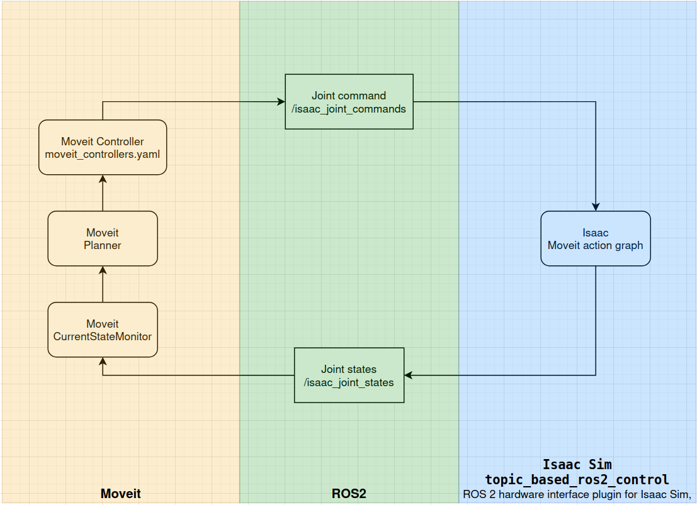

# Preparation (For PC with RTX 5080)

## Rollback to cuda 12.x (570 branch) for zed isaac extension
```bash
#Script to install NVIDIA drivers for 50XX series on Ubuntu 24.04
#
# Why use the `-open` driver?
# ----------------------------
# - NVIDIA 50XX (Blackwell) GPUs are only supported by the open kernel modules.
# - The traditional proprietary DKMS-based drivers do not support this series.
# - `nvidia-driver-<version>-open` is still maintained by NVIDIA and provides
#   full CUDA support (unlike Nouveau).

set -euo pipefail

VERSION="${1:-570}"

# Removing old NVIDIA drivers
sudo apt purge -y "nvidia-*" "libnvidia-*"

# Installing NVIDIA driver version ${VERSION}-open
sudo apt install -y "nvidia-driver-${VERSION}-open"

sudo reboot
```

## 1. Install the driver
```bash
sudo apt-get install -y nvidia-open
sudo reboot
nvidia-smi
```
## 2. Install the CUDA Toolkit
```bash
wget https://developer.download.nvidia.com/compute/cuda/repos/ubuntu2404/x86_64/cuda-keyring_1.1-1_all.debsudo dpkg -i cuda-keyring_1.1-1_all.debsudo apt-get updatesudo apt-get -y install cuda-toolkit-12-9
```

## 3. Install Docker
```bash
curl -fsSL https://get.docker.com -o get-docker.sh
sudo sh get-docker.sh
```
```bash
# Post-install steps for Docker
sudo groupadd docker # Create group
sudo usermod -aG docker $USER # Add current user to docker group
newgrp docker # Log in docker group
```
```bash
#Verify Docker installation
docker run hello-world
```

## 4. Install the NVIDIA Container Toolkit packages
```bash
sudo apt-get install -y nvidia-container-toolkit
sudo systemctl restart docker

# Configure the container runtime
sudo nvidia-ctk runtime configure --runtime=docker
sudo systemctl restart docker

# Verify NVIDIA Container Toolkit
docker run --rm --runtime=nvidia --gpus all ubuntu nvidia-smi
```

## 5. Generate NGC API Key: 
https://docs.nvidia.com/ngc/ngc-overview/index.html#generating-api-key
- Log in to NGC:
```bash
docker login nvcr.io
```
```bash
Username: $oauthtoken
Password: <Your NGC API Key>
WARNING! Your password will be stored unencrypted in /home/username/.docker/config.json.
Configure a credential helper to remove this warning. See
credentials-store
Login Succeeded
```

## 6. Build the image for isaac-sim and run the container
Build:
```bash
docker build -t isaac_sim_ros2:4.2.0-Humble .
```

Run:
```bash
xhost +
```
```bash
docker run --name isaac-moveit --privileged --entrypoint bash -it --gpus all -e "ACCEPT_EULA=Y" --network=host   -e "PRIVACY_CONSENT=Y"   -v $HOME/.Xauthority:/root/.Xauthority   -e DISPLAY   -v ~/docker/isaac-sim/cache/kit:/isaac-sim/kit/cache:rw   -v ~/docker/isaac-sim/cache/ov:/root/.cache/ov:rw   -v ~/docker/isaac-sim/cache/pip:/root/.cache/pip:rw   -v ~/docker/isaac-sim/cache/glcache:/root/.cache/nvidia/GLCache:rw   -v ~/docker/isaac-sim/cache/computecache:/root/.nv/ComputeCache:rw   -v ~/docker/isaac-sim/logs:/root/.nvidia-omniverse/logs:rw   -v ~/docker/isaac-sim/data:/root/.local/share/ov/data:rw   -v ~/docker/isaac-sim/documents:/root/Documents:rw   -v /home/yuanyan/Documents/robco:/isaac-sim/robco   isaac_sim_ros2:4.2.0-Humble
```

## 7. Other dependencies:
```bash
apt update
apt install ros-humble-robot-localization
apt install ros-humble-ros2-control
apt install ros-humble-ros2-controllers
apt install ros-humble-gripper-controllers
apt install ros-humble-moveit
apt install ros-humble-topic-based-ros2-control
```

## 8. Isaac-sim-5.0
Known that Isaac-sim 4.5.0 has blurry rendering issue with RTX-5080/90, to solve this, update to Isaac-sim-5.0. Do following steps inside container:
https://github.com/isaac-sim/IsaacSim

## 9. ZED in container
- Install nvcc inside container
```bash
wget https://developer.download.nvidia.com/compute/cuda/repos/ubuntu2404/x86_64/cuda-keyring_1.1-1_all.deb
sudo dpkg -i cuda-keyring_1.1-1_all.deb
sudo apt-get update
sudo apt-get -y install cuda-toolkit-12-9
```
- Add CUDA to PATH:
```bash
export PATH=/usr/local/cuda-12.8/bin:$PATH
export LD_LIBRARY_PATH=/usr/local/cuda-12.8/lib64:$LD_LIBRARY_PATH
```
- Check installation
```bash
nvcc --version
nvidia-smi
```
- Install ZED SDK: Use the '-- silent' command
https://www.stereolabs.com/docs/development/zed-sdk/linux
- ZED ROS2 Wrapper
https://www.stereolabs.com/docs/ros2
- and ZED Isaac extension
https://github.com/stereolabs/zed-isaac-sim 

## 10. Install AEDE
```bash
# Following instructions are for humble, for Jazzy: https://drive.google.com/file/d/1a01RSrPFan9SV2g2BFP_8GGtnamAdGIc/view?pli=1

cd robco/aede_isaac
sudo apt update
sudo apt install libusb-dev ros-humble-desktop-full ros-humble-joy ros-humble-gazebo-msgs \
ros-humble-gazebo-plugins ros-humble-gazebo-ros ros-humble-gazebo-ros2-control \
ros-humble-gazebo-ros-pkgs python3-colcon-common-extensions

colcon build # don't use symlink
```

# Usage
## 1. After installing Isaac Sim 5.0, run the app by:
```bash
xhost +
docker start -ai isaac-sim-5
```
```bash
sudo apt update
sudo apt install ros-${ROS_DISTRO}-rmw-cyclonedds-cpp

cd /isaac5/isaacsim/_build/linux-x86_64/release
export RMW_IMPLEMENTATION=rmw_cyclonedds_cpp
export ROS_DOMAIN_ID=0
./isaac-sim.sh --allow-root
```

## 2. Launch ZED ROS2 Wrapper
```bash
export RMW_IMPLEMENTATION=rmw_cyclonedds_cpp
export ROS_DOMAIN_ID=0
ros2 launch zed_wrapper zed_camera.launch.py camera_model:=zedx sim_mode:=true
```
## 3. Launch AEDE
```bash
source install/setup.bash
ros2 launch launch/aede_isaac.launch.py
```

## Launch Moveit
```bash
cd robco/mobile_robco_new
source install/setup.bash
ros2 launch robco_moveit_config_new_design demo.launch.py
```

## Drive the robot
```bash
ros2 run teleop_twist_keyboard teleop_twist_keyboard
```

Robot control flow in Isaac
