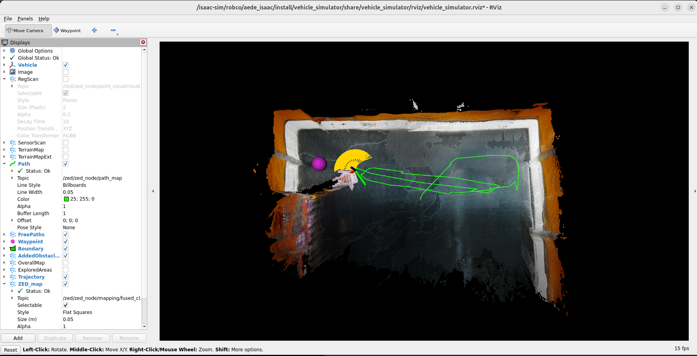
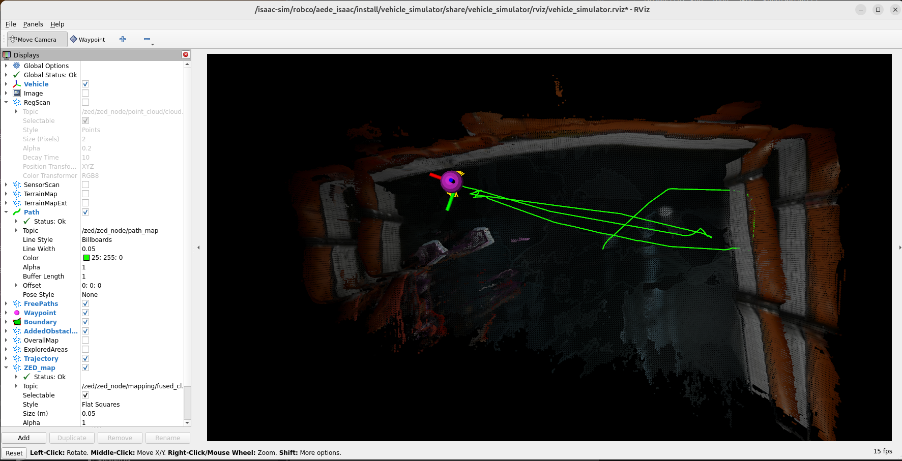
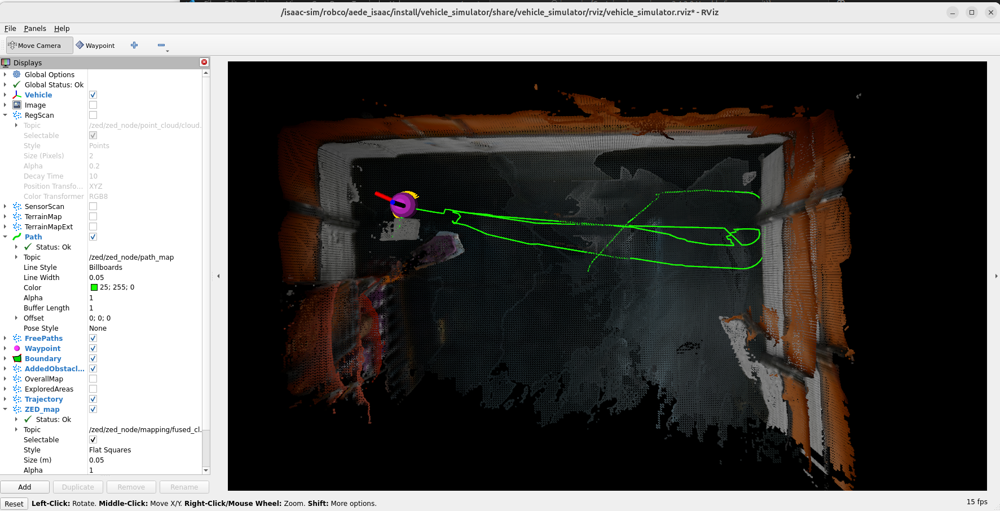
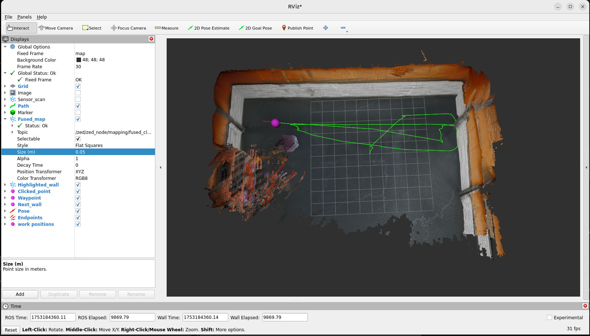
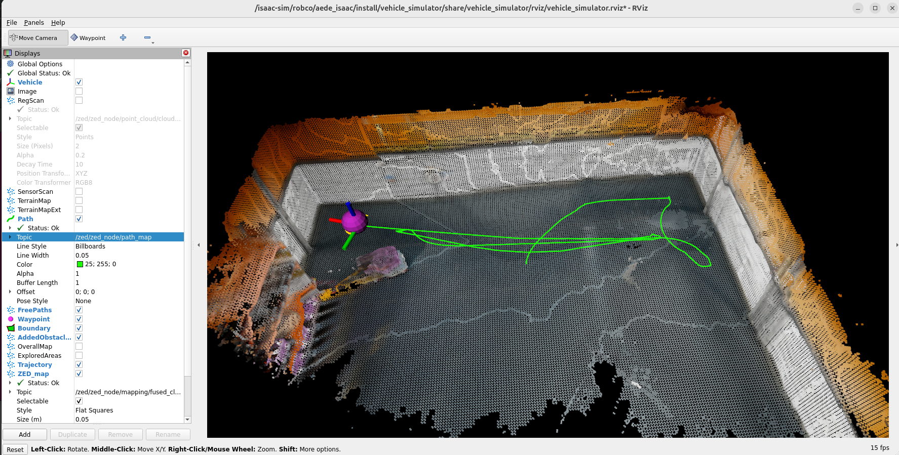
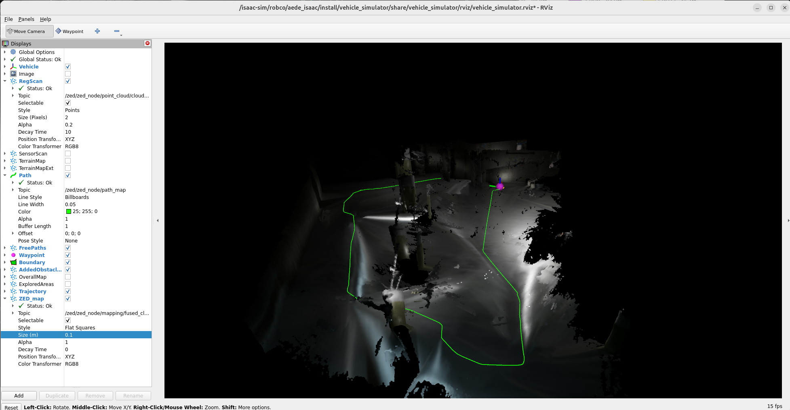
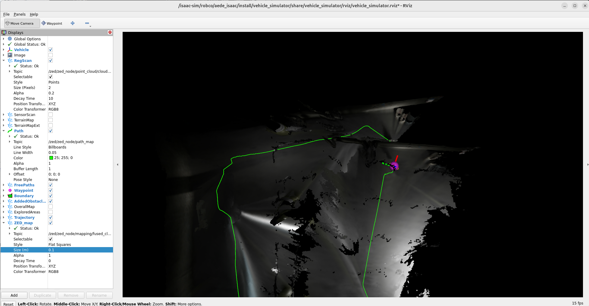

# Wall scanning

## Concept:
Tasks like trajectory planning for concrete removal requires detection and detailed scanning of the walls. To achieve that, we propose a method which can scan the walls incremently. Follow steps will be excuted for scanning of a **single** wall:
1. Human workder clicks a point in the point cloud from RViz2, a point in 'map' frame will be published to topic **/clicked_point**.

2. Region growing node subscribe to this topic and **/zed/zed_node/mapping/fused_cloud** topic, check if there are any other planes. If none of them is observed, the wall is considered as not completed. The exploration strategy will be applied following.

3. Completion check (check_completion.cpp):

    Create a 3D bounding box for the first segemented point cloud, move the robot, if new added points show in this bbox, then the new highlighted region blongs to a same wall.

    The boundary of cluster of interset is found when the normal is 

4. Scanning and Exploration (move_base.cpp): 

    - Looking around: 
    The robot starts by rotating the ZED camera, in the example of Carter-v1 robot, this can done by using differential drive: 
        ```bash
        ros2 topic pub /cmd_vel geometry_msgs/Twist "{'linear': {'x': 0.0, 'y': 0.0, 'z': 0.0}, 'angular': {'x': 0.0, 'y': 0.0, 'z': 1.0}}"
        ros2 run teleop_twist_keyboard teleop_twist_keyboard
        ```
    If the wall point cloud is still uncompleted after looking aroud, it will try to move the base for exploration later.
    - Detailed scanning and operating:
    After looking around, robot move to the

    Need to be checked: if Zed update the fused map or it will keep the bad points. 
    Strategy: robot moves to nearest chunck without looking around, then plan to go an unclosed endpoint for detailed scanning.so that can get better map quality


## Usage
1. Launch ZED ROS2 wrapper and AEDE
    ```bash
    ros2 launch zed_wrapper zed_camera.launch.py camera_model:=zedx sim_mode:=true use_sim_time:=true
    ```

    ```bash
    cd robco/aede_isaac
    source install/setup.bash
    ros2 launch launch/aede_isaac.launch.py
    ```

2. Region growing:
    ```bash
    cd robco/wall_scanning/region_growing_segmentation
    source install/setup.bash
    ros2 run region_growing_segmentation region_growing_segmentation_node
    ```

3. Move the base:
    ```bash
    cd robco/wall_scanning/move_base
    source install/setup.bash
    ros2 run move_base move_base

    ros2 run move_base move_base_scan_all
    ```

4. Launch RViz2, click one point in the point cloud, you should see its cluster being highlighted.

## Tuning for better mapping accuracy - ZED camera
### 0. Best practice: 
Lower the robot's speed (linear and angular), which can signicantly reduce artifacts. In test case, the values can be:
```bash
maxAcceleration 0.5
maxAngularSpeed 0.5
maxLinearSpeed 0.5
```
### 1. pos_tracking:
- pos_tracking_mode:
    GEN_1 is the first version of the positional tracking module, mostly based on visual odometry. Using the IMU only to improve the orientation estimation.
    GEN_2 is the first “next-gen” algorithm with a full integration of Visual and Inertial information. It requires more compute resources than GEN_1, but it’s more reliable.
    GEN_3 is the new evolution; it provides better accuracy than the other modes and requires lower performance. We expect to release a stable version with SDK v5.1.

    GEN_2 and GEN_3 cannot be used in simulation.
    https://community.stereolabs.com/t/pos-tracking-mode-settings-and-jitters/9309

- initial_base_pose: 
    Use for re-initilization?

### 2. Test ZED under different lighting conditions
- Light control: /World/warehouse_with_forklifts/Warehouse_Empty_small_realtime/RectLight
    
    intensity: 500, 1000, 2500, 5000(default)

- Waypoints:
```bash
cd robco/wall_scanning/pub_wp
source install/setup.bash
ros2 run pub_wp pub_wp
```

- Robot with light
    - 500:
    Better than w/o light
    

- Robot without light
    - 500:
    Serious distortion.
    

    - 1000:
    Struggued to move to last way point, artifacts on the left and right sides.
    
    

    - 2500:
    Artifacts on the left and right sides.
    

    - 5000:
    

### 3. Test ZED with different wall texture 
- Warehouse, Garage, ...
- Idea: 
https://community.stereolabs.com/t/depth-noise-on-zed2i/4861
    - Add features to the wall to break the uniformity, such as colored tapes
    - Use projector to creat unique texture on the wall, but the projector need to be fixed?
- Tested ZED in garage scene,which contains a lot of repetitive textures:
The odom drifts after long-term exploration, the walls and columns are not at correct positions in post scan. But overall the result is acceptable. Performance can be improved by adding a light (against poor lighting). Also the textures are much repetive than the textures in real world, since they are generate by an image.



### 4. Re-initilization
Read current pose before shutting down, then pass to initial_base_pose: [0.0, 0.0, 0.0, 0.0, 0.0, 0.0] in map frame.

